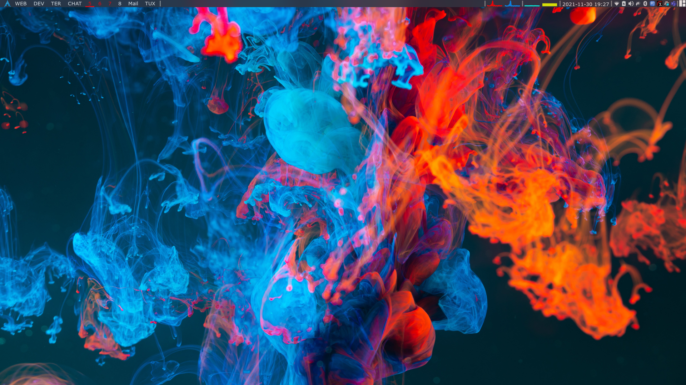

``` bash
###############################################################
#>     __                _      <> DotFiles                  <#
#>    / /   __  ___   __(_)___  <> Bardia Jedi               <#
#>   / /   / / / / | / / /_  /  <>                           <#
#>  / /___/ /_/ /| |/ / / / /_  <>                           <#
#> /_____/\__,_/ |___/_/ /___/  <> https://github.com/luviz  <#
#>                              <>                           <#
###############################################################
```




Arch linux running sddm, qtile, alacritty, fish, dmenu and rofi.

# Dot files  
* qtile 
* starship
* alacritty
* fish

## QTile 
Inspired from _garuda linux qtile edition_, and heavily modified. Blue and red theme contrasting the arch logo! 

The background of incs droplets in water by @Aznbokchoy makes the theme blue and red pop even more. 
